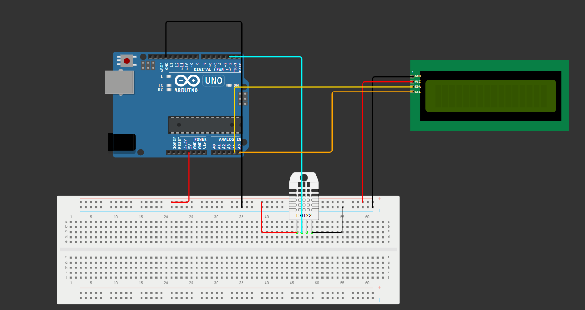

# 🌦️ Weather Station Project

A simple **Arduino-based Weather Station** that measures and displays environmental parameters: temperature and humidity.  
This project combines sensor data acquisition with digital display and serial monitoring.

---

## Project Overview

| Real Project | Simulation |
|:-------------:|:-----------:|
|  | 

---

## Hardware Components
- Arduino Uno R3
- DHT11 sensor for temperature & humidity
- I2C LCD Display
- Breadboard and jumper wires

---

## Software
- **Arduino IDE
- Required libraries:
  - `DHT.h`
  - `Wire.h`
  - `LiquidCrystal_I2C.h` 

---

